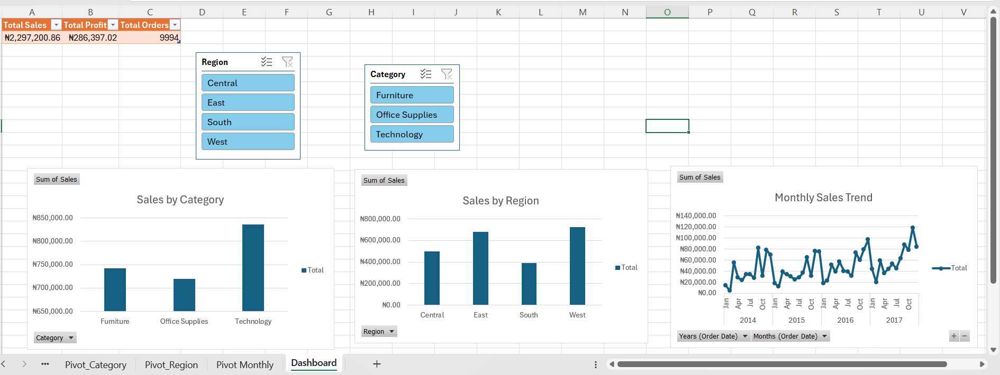
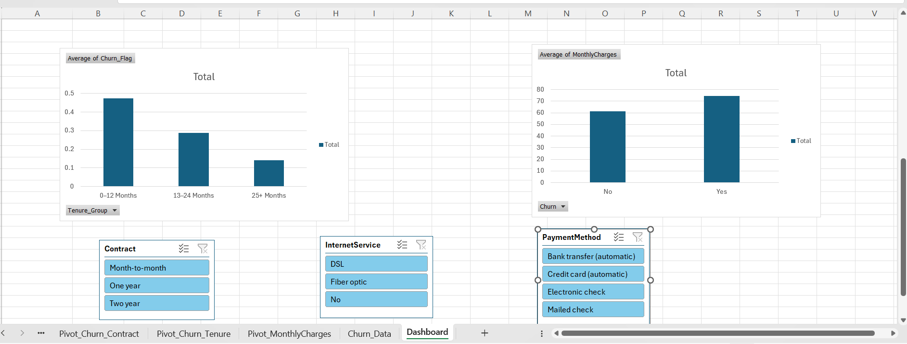
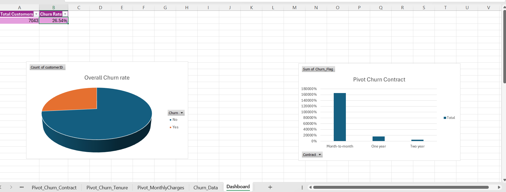
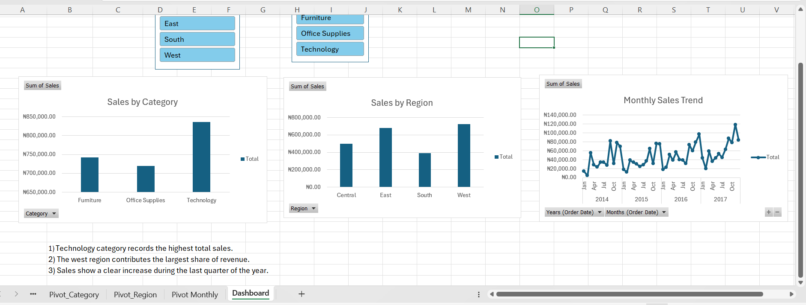
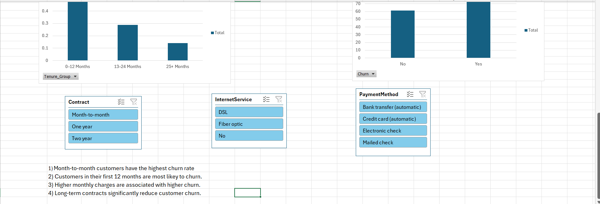

# Customer Churn Analysis Using Excel and SQL (MySQL)

## Overview
This project analyzes customer churn data using SQL to identify key factors that contribute to customer attrition and to provide actionable business insights.

## Objectives
- Calculate overall customer churn rate
- Identify customer segments with high churn
- Analyze churn by contract type and tenure
- Examine the relationship between monthly charges and churn

## Tools Used
- MySQL Workbench
- SQL (CASE, GROUP BY, AVG, COUNT)

## Dataset
- Telco Customer Churn Dataset
- Approximately 7,000 customer records

## Excel Dashboard

The Excel workbook contains comprehensive churn analysis with interactive visualizations and pivot tables.

📊 **[Download Excel Analysis](customer-churn-analysis.xlsx)**

## Excel Dashboard & Analysis

### Churn Analysis Overview


### Average Churn Rate


### Churn Chart


### Sales Trend Analysis


### Pivot Table Summary


## Key SQL Queries

### Total Customers
```sql
SELECT COUNT(*) AS total_customers
FROM churn_data;
SELECT AVG(CASE WHEN Churn = 'Yes' THEN 1 ELSE 0 END) AS churn_rate
FROM churn_data;
SELECT Contract,
       AVG(CASE WHEN Churn = 'Yes' THEN 1 ELSE 0 END) AS churn_rate
FROM churn_data
GROUP BY Contract;
SELECT CASE
         WHEN tenure <= 12 THEN '0–12 Months'
         WHEN tenure <= 24 THEN '13–24 Months'
         ELSE '25+ Months'
       END AS tenure_group,
       AVG(CASE WHEN Churn = 'Yes' THEN 1 ELSE 0 END) AS churn_rate
FROM churn_data
GROUP BY tenure_group;
SELECT Churn, AVG(MonthlyCharges) AS avg_monthly_charges
FROM churn_data
GROUP BY Churn;
